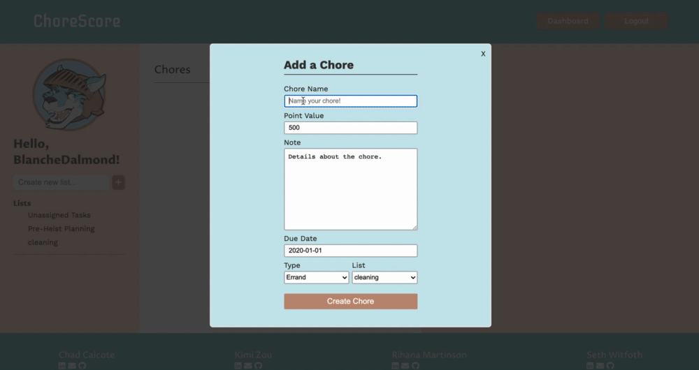

<p align='center'>
  
</p>

## ChoreScore

* About the project: a remember the milk clone made to assist users in completing their chores with a to-do like system.
* Planning before coding: <a href='https://github.com/ChadCalcote/ChoreScore/wiki'>ChoreScore wiki docs</a>
* View live: <a href='https://chorescore2020.herokuapp.com/'>ChoreScore live app</a>

<br />

## Table of Contents

  * [Technologies Used](#technologies-used)
  * [Installation](#installation)
  * [Featrues](#features)
  * [Contact](#contact)

<br />

## Technologies Used

  * Languages: 
  * Frontend: 
    
    
    
  * Backend:
     
    
    

<br />

## Installation

1. Install packages
```
npm install
```

2. Start server
```
npm start
```
<br />

## Features

Login/Signup and Demo Login


<br />

Create a List


<br />

Create a Chore


<br />

Edit a chore


<br />

## Contributors
* Chad Calcote:   
  <a href='mailto:calcote@att.net'>
    
  </a>
  <a href='https://www.linkedin.com/in/chadcalcote/'>
    
  </a>
  <a href='https://angel.co/u/chad-calcote'>
    
  </a>
  <a href='https://github.com/ChadCalcote'>
    
  </a>

* Kimi Zou:   
  <a href='mailto:kimizou.kz@gmail.com'>
    
  </a>
  <a href='https://www.linkedin.com/in/kimizou/'>
    
  </a>
  <a href='https://angel.co/u/kimi-zou'>
    
  </a>
  <a href='https://github.com/Kimi-Zou'>
    
  </a>

* Rihana Martinson:   
  <a href='mailto:martinson.r@gmail.com'>
    
  </a>
  <a href='linkedin.com/in/rihanamartinson'>
    
  </a>
  <a href='https://angel.co/u/rihana-martinson'>
    
  </a>
  <a href='https://github.com/martinson-r'>
    
  </a>


* Seth Witfoth:  
  <a href='mailto:switfoth@gmail.com'>
    
  </a>
  <a href='linkedin.com/in/seth-witfoth'>
    
  </a>
  <a href='https://angel.co/u/seth-witfoth'>
    
  </a>
  <a href='https://github.com/switfoth'>
    
  </a>
